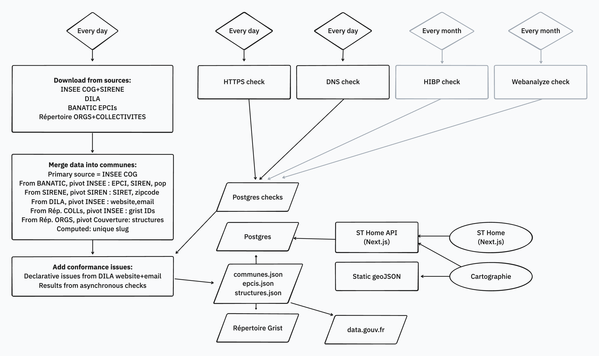

# La Suite territoriale - Site vitrine

https://suiteterritoriale.anct.gouv.fr/

Cette application implémente la page d'accueil de la Suite territoriale, ainsi que le chemin de raccordement pour les collectivités.

Son code est basé sur [Next.js](https://nextjs.org/), et a été initié à partir du [template Next.js de betagouv](https://github.com/betagouv/template-nextjs).

## Lancer le code

Après avoir cloné le projet :

### Développement

```bash
make bootstrap
```

Il suffit ensuite de se rendre sur [http://localhost:8950/](http://localhost:8950/).

Pour voir toutes les commandes disponibles, il est possible de lancer :

```bash
make help
```

### Services de développement

Les services suivants sont disponibles :

| Service            | URL / Port                                     | Description                                | Identifiants  |
| ------------------ | ---------------------------------------------- | ------------------------------------------ | ------------- |
| **Frontend**       | [http://localhost:8950](http://localhost:8950) | Site vitrine en développement              | Aucun         |
| **PostgreSQL**     | 8951                                           | Serveur de base de données                 | `usr` / `pwd` |
| **Redis**          | 8952                                           | Cache et courtier de messages              | Aucun         |
| **Celery UI**      | [http://localhost:8953](http://localhost:8953) | Supervision de la file de tâches           | Aucun         |
| **Drizzle Studio** | [http://localhost:8954](http://localhost:8954) | Interface de gestion de la base de données | Aucun         |

### Production de données



Un conteneur Python utilisant le code de `data/` est lançable avec :

```bash
make data-shell
```

Une fois dedans, il est possible de lancer les tâches de synchronisation des données :

```bash
# Tout synchroniser
python -m tasks.sync

# Lancer une tâche de vérification manuellement
python -m tasks.check_website [SIRET]
python -m tasks.check_dns [SIRET]

```

Cela peut permettre de débugguer des problèmes liés à certains SIRETs en particulier.

Il est recommandé d'ajouter des tests unitaires à chaque nouveau cas pour rendre les vérifications plus robustes.

### Mise à jour des dépendances

Après avoir modifié une dépendance Python dans `data/pyproject.toml`, il est nécessaire de recréer le lockfile :

```bash
make data-freeze-deps
```

Idem pour le frontend. Après avoir modifié une dépendance dans `package.json`, il est nécessaire de recréer le lockfile :

```bash
make front-freeze-deps
```

Une autre méthode est de lancer `make front-shell` et de faire un `npm install _package_` depuis le conteneur.

### Base de données

L'application utilise [Drizzle ORM](https://orm.drizzle.team/) pour gérer la base de données PostgreSQL.

Pour réinitialiser la base de données avec des données de test :

```bash
# Réinitialiser la base de données avec des données de test
make db-reset-sample

# Explorer la base de données avec Drizzle Studio
make db-browse
```

#### Ajout de colonnes dans la base de données

En cas d'ajout de colonnes gérées par Drizzle dans la base de données Postgres, voici la procédure à suivre :

- Modifier `src/lib/schema.ts`
- Executer `make db-push` pour modifier la table
- Executer `make db-seed` pour importer les nouvelles données
- Si besoin, ajouter ces colonnes aux tables `*_history` manuellement

Ces étapes sont à répéter en staging puis en prod.

### Tests

```
# lancer tous les tests
make test

# a refaire avant chaque commit
make lint
```

## Mise à jour des fichiers geoJSON

### Prérequis

- Mapshaper installé sur votre système ([https://github.com/mbloch/mapshaper](https://github.com/mbloch/mapshaper))

### Procédure

#### 1. Téléchargement des données

Télécharger la dernière version des données ADMIN EXPRESS de l'IGN, version France Entière, depuis :
[https://geoservices.ign.fr/adminexpress](https://geoservices.ign.fr/adminexpress)

#### 2. Génération du geoJSON des régions

```bash
mapshaper -i REGION.shp snap -proj wgs84 -simplify 5% weighted keep-shapes -filter-fields INSEE_REG,NOM -rename-fields INSEE_GEO=INSEE_REG,NAME=NOM -o format=geojson precision=0.00001 regions.json
```

#### 3. Génération des geoJSON des départements par région

```bash
mapshaper -i REGION.shp name=regions -i DEPARTEMENT.shp name=depts -clip target=depts source=regions -proj wgs84 -simplify 5% weighted keep-shapes -filter-fields INSEE_DEP,INSEE_REG,NOM -rename-fields INSEE_GEO=INSEE_DEP,NAME=NOM -split INSEE_REG -o format=geojson precision=0.00001
```

#### 4. Génération des geoJSON des communes par département

```bash
mapshaper -i DEPARTEMENT.shp name=depts -i COMMUNE.shp name=communes -clip target=communes source=depts -proj wgs84 -simplify 5% weighted keep-shapes -filter-fields INSEE_COM,INSEE_DEP,NOM -rename-fields INSEE_GEO=INSEE_COM,NAME=NOM -split INSEE_DEP -o format=geojson precision=0.00001
```

### Résultats

Cette procédure générera :

- Un fichier `france.json` contenant les données des régions
- Des fichiers séparés pour chaque région, contenant l'ensemble des départements de cette région
- Des fichiers séparés pour département, contenant l'ensemble des communes de ce département
